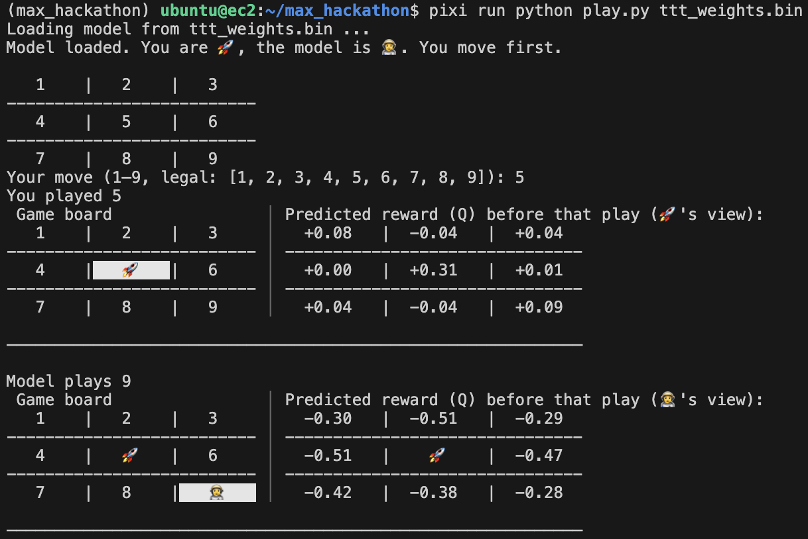

# Tic-Tac-Toe AI with MAX Engine

A reinforcement learning agent that plays Tic-Tac-Toe using Deep Q-Learning, implemented with Modular's MAX Engine. The model trains through self-play and learns optimal strategy through experience replay and TD learning.



## Usage

Train the model:
```bash
pixi run python ttt.py
```

Play against the trained model:
```bash
pixi run python play.py
```
